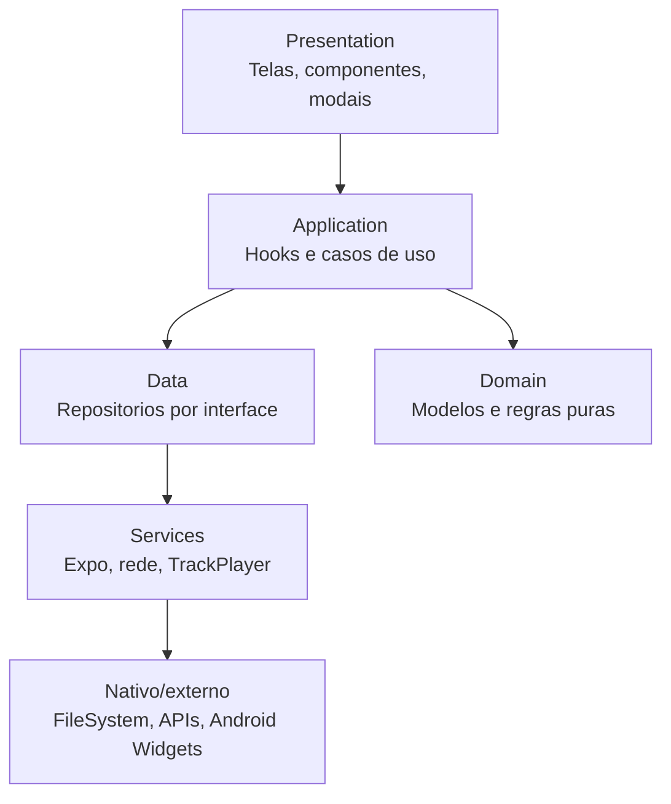
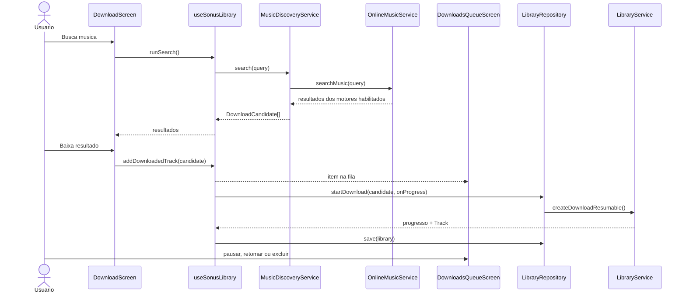
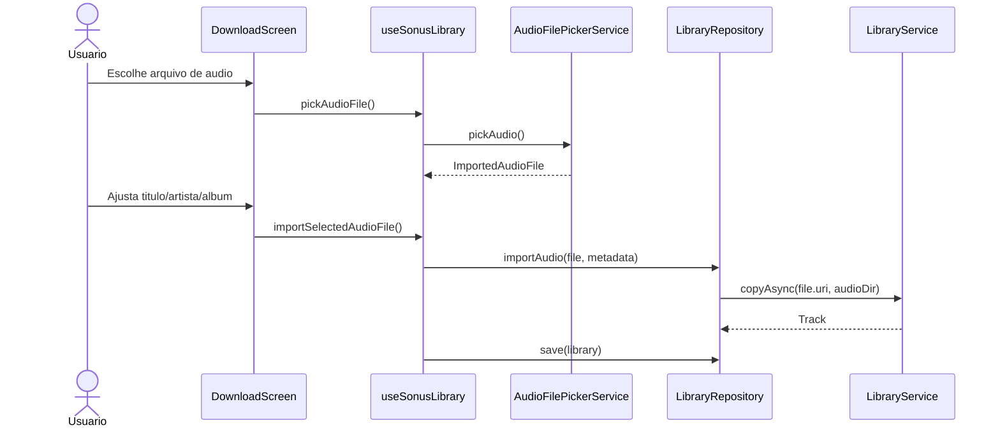
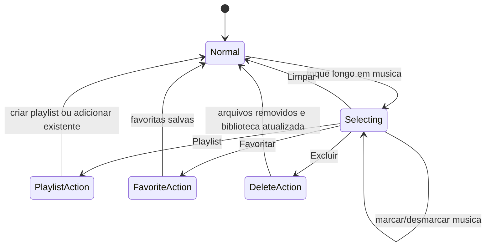
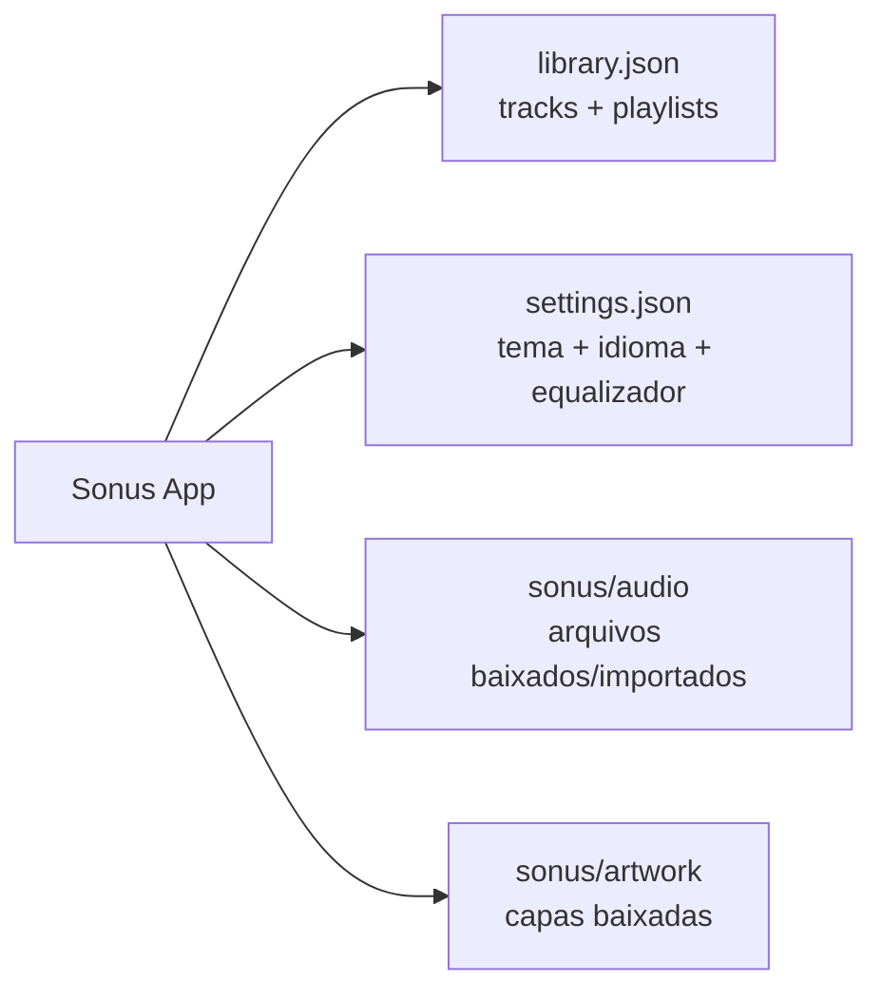
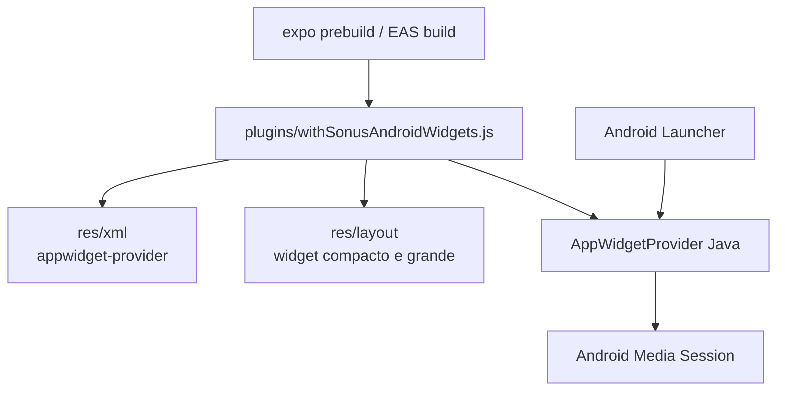

# Diagramas

## Arquitetura em camadas

```mermaid
flowchart TB
  UI["Presentation\nTelas, componentes, modais"]
  APP["Application\nHooks e casos de uso"]
  DATA["Data\nRepositorios por interface"]
  DOMAIN["Domain\nModelos e regras puras"]
  SERVICES["Services\nExpo, rede, TrackPlayer"]
  NATIVE["Nativo/externo\nFileSystem, APIs, Android Widgets"]

  UI --> APP
  APP --> DOMAIN
  APP --> DATA
  DATA --> SERVICES
  SERVICES --> NATIVE
```

## Fluxo de busca e download

```mermaid
sequenceDiagram
  actor User as Usuario
  participant Screen as DownloadScreen
  participant Hook as useSonusLibrary
  participant Discovery as MusicDiscoveryService
  participant Online as OnlineMusicService
  participant Queue as DownloadsQueueScreen
  participant Repo as LibraryRepository
  participant Storage as LibraryService

  User->>Screen: Busca musica
  Screen->>Hook: runSearch()
  Hook->>Discovery: search(query)
  Discovery->>Online: searchMusic(query)
  Online-->>Discovery: resultados dos motores habilitados
  Discovery-->>Hook: DownloadCandidate[]
  Hook-->>Screen: resultados
  User->>Screen: Baixa resultado
  Screen->>Hook: addDownloadedTrack(candidate)
  Hook-->>Queue: item na fila
  Hook->>Repo: startDownload(candidate, onProgress)
  Repo->>Storage: createDownloadResumable()
  Storage-->>Hook: progresso + Track
  Hook->>Repo: save(library)
  User->>Queue: pausar, retomar ou excluir
```

## Fluxo de importacao local

```mermaid
sequenceDiagram
  actor User as Usuario
  participant Screen as DownloadScreen
  participant Hook as useSonusLibrary
  participant Picker as AudioFilePickerService
  participant Repo as LibraryRepository
  participant Storage as LibraryService

  User->>Screen: Escolhe arquivo de audio
  Screen->>Hook: pickAudioFile()
  Hook->>Picker: pickAudio()
  Picker-->>Hook: ImportedAudioFile
  User->>Screen: Ajusta titulo/artista/album
  Screen->>Hook: importSelectedAudioFile()
  Hook->>Repo: importAudio(file, metadata)
  Repo->>Storage: copyAsync(file.uri, audioDir)
  Storage-->>Repo: Track
  Hook->>Repo: save(library)
```

## Selecao multipla

```mermaid
stateDiagram-v2
  [*] --> Normal
  Normal --> Selecting: toque longo em musica
  Selecting --> Selecting: marcar/desmarcar musica
  Selecting --> PlaylistAction: Playlist
  Selecting --> FavoriteAction: Favoritar
  Selecting --> DeleteAction: Excluir
  Selecting --> Normal: Limpar
  PlaylistAction --> Normal: criar playlist ou adicionar existente
  FavoriteAction --> Normal: favoritas salvas
  DeleteAction --> Normal: arquivos removidos e biblioteca atualizada
```

## Persistencia

```mermaid
flowchart LR
  LIB["library.json\ntracks + playlists"]
  SET["settings.json\ntema + idioma + equalizador"]
  AUDIO["sonus/audio\narquivos baixados/importados"]
  ART["sonus/artwork\ncapas baixadas"]

  APP["Sonus App"] --> LIB
  APP --> SET
  APP --> AUDIO
  APP --> ART
```

## Widgets Android

```mermaid
flowchart TB
  PRE["expo prebuild / EAS build"]
  PLUGIN["plugins/withSonusAndroidWidgets.js"]
  XML["res/xml\nappwidget-provider"]
  LAYOUT["res/layout\nwidget compacto e grande"]
  JAVA["AppWidgetProvider Java"]
  LAUNCHER["Android Launcher"]
  MEDIA["Android Media Session"]

  PRE --> PLUGIN
  PLUGIN --> XML
  PLUGIN --> LAYOUT
  PLUGIN --> JAVA
  LAUNCHER --> JAVA
  JAVA --> MEDIA
```
